# Visual Architecture Diagrams

## 📊 Current System (MVP1) - Visual Representation

### System Overview

### Data Flow Diagram

---

## 🚀 Enhanced Agentic System (MVP2) - Visual Representation

### Multi-Agent Architecture

### Agent Communication Flow

### Enhanced Data Architecture

## 🔄 Agent Specialization Matrix

### Agent Capabilities Overview

## 🎯 Implementation Roadmap

### Phase-wise Development

## 📈 Performance Comparison

### MVP1 vs MVP2 Expected Improvements

## 🔧 Technical Architecture Stack

### Technology Stack Overview

```mermaid
block-beta
    columns 4

    Frontend["🖥️ Frontend Layer"]:4
    React["React Components"] TypeScript["TypeScript"] Router["React Router"] CSS["CSS Modules"]

    space:4

    AgentLayer["🤖 Agent Layer"]:4
    Orchestrator["Orchestrator"] TaskAgent["Task Planner"] ContentAgent["Content Creator"] AnalysisAgent["Analysis Agent"]

    space:4

    AIServices["🧠 AI Services"]:4
    Gemini1["Gemini API 1"] Gemini2["Gemini API 2"] Gemini3["Gemini API 3"] Gemini4["Gemini API 4"]

    space:4

    DataLayer["💾 Data Layer"]:4
    Chrome["Chrome Storage"] Local["Local Storage"] Memory["In-Memory Cache"] Sync["Sync Manager"]
```

This comprehensive architecture documentation provides you with:

1. **Current System Understanding**: Complete overview of your existing MVP1 architecture
2. **Enhanced Vision**: Detailed agentic AI system design for MVP2
3. **Visual Diagrams**: Easy-to-understand flowcharts and architecture diagrams
4. **Implementation Roadmap**: Step-by-step development plan
5. **Performance Expectations**: Clear benefits and improvements expected

The enhanced agentic AI system will transform your personal assistant from a single AI interaction to a sophisticated multi-agent network that provides much richer, more accurate, and highly contextual responses! 🚀
